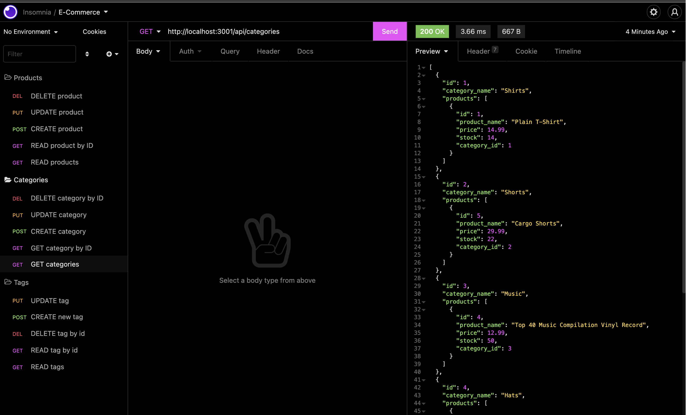
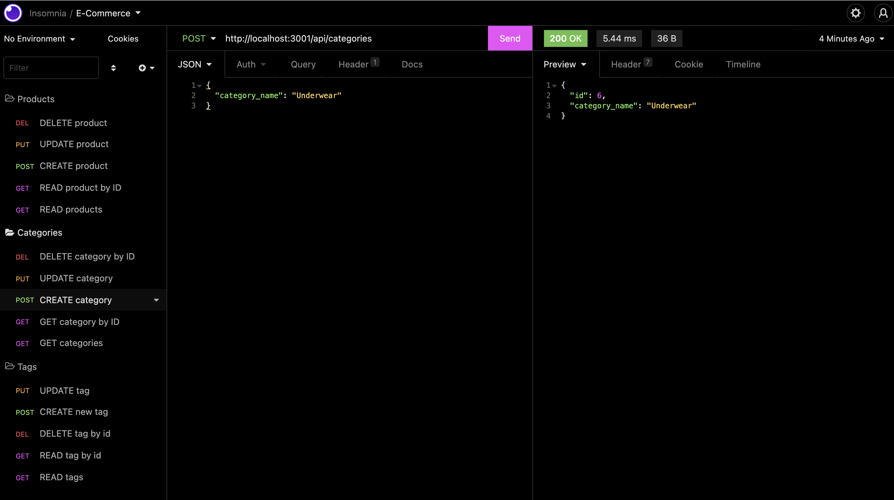
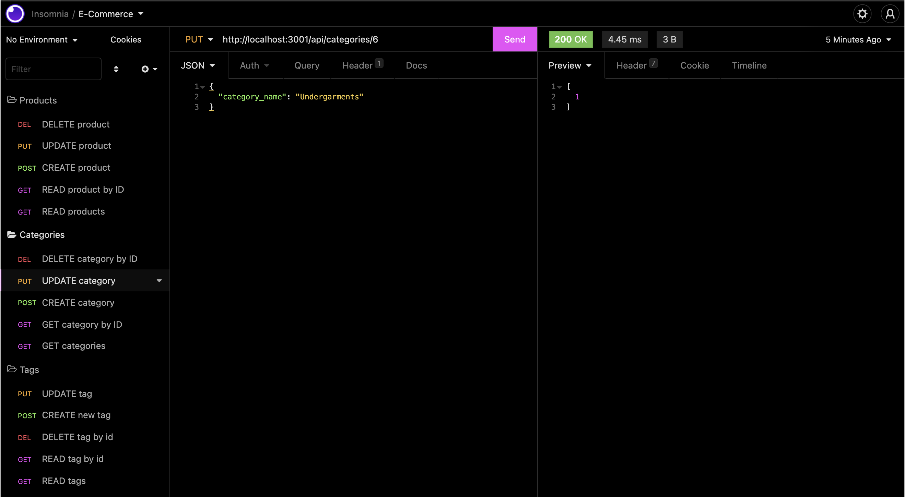
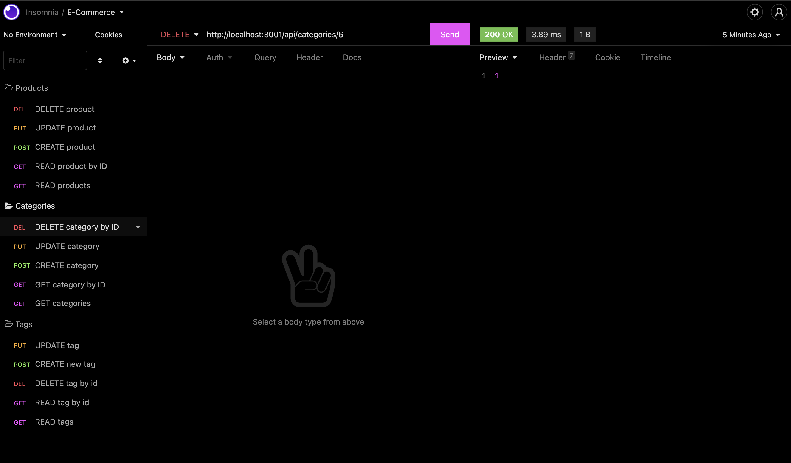

# General E-Commerce Back End
## Description
* General E-Commerce configures an Express.js API to use Sequelize to interact with a MySQL database.

* See [video demo](https://watch.screencastify.com/v/VWWex69lXZnAvf9AvWIt)

## Screenshots





## Installation 

Fork and clone the repo from your own github, or download the files.

## Usage
* Run the following to install all dependencies:
```bash
npm install
``` 
* Make sure to create your own .env file from the .env.EXAMPLE.

* Create your database in mysql with:
```bash
mysql -u root -p

CREATE DATABASE databasename;
```
* OR use the schema.sql file with:
```
mysql -u root -p
SOURCE schema.sql;
```

* Seed the database with sample data using:
```bash
npm run seed
```
* The application will be invoked by using the following command:

```bash
npm start
``` 

* You can use a tool such as Insomnia to check the routes.

## User Story

```md
AS A manager at an internet retail company
I WANT a back end for my e-commerce website that uses the latest technologies
SO THAT my company can compete with other e-commerce companies
```

```md
GIVEN a functional Express.js API
WHEN I add my database name, MySQL username, and MySQL password to an environment variable file
THEN I am able to connect to a database using Sequelize
WHEN I enter schema and seed commands
THEN a development database is created and is seeded with test data
WHEN I enter the command to invoke the application
THEN my server is started and the Sequelize models are synced to the MySQL database
WHEN I open API GET routes in Insomnia for categories, products, or tags
THEN the data for each of these routes is displayed in a formatted JSON
WHEN I test API POST, PUT, and DELETE routes in Insomnia
THEN I am able to successfully create, update, and delete data in my database
```